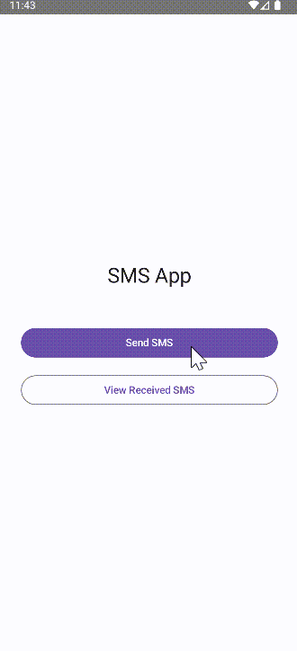
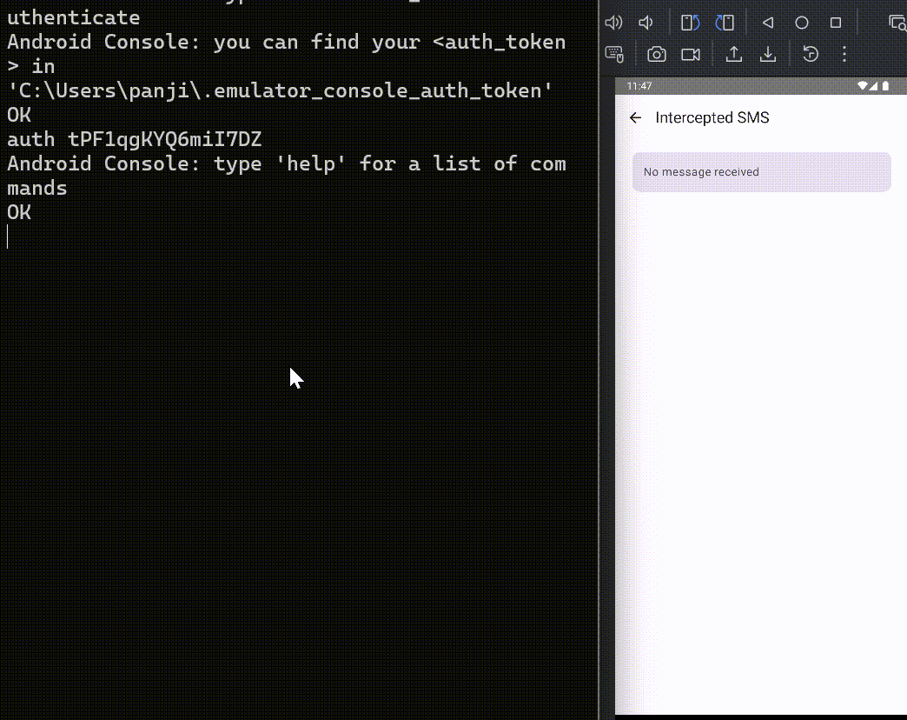

# SMS demo - Jetpack Compose

A simple SMS Android app, allowing sending and intercepting messeges.

## Screenshot

- Test with sending sms

  

- Test with intercepting sms

  

## Run
```bash
telnet localhost 5554
auth <your_emulator_auth_token>
sms send +15555215554 This is RadarApp
```

