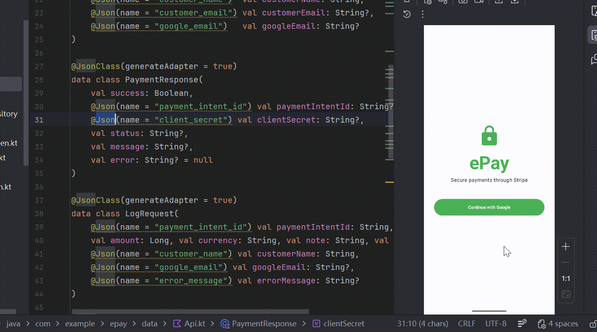
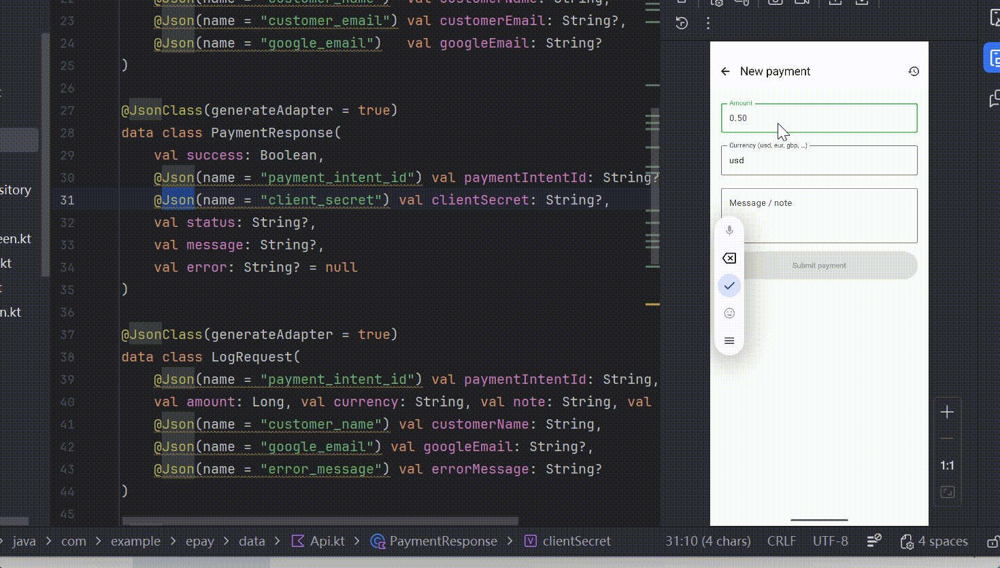
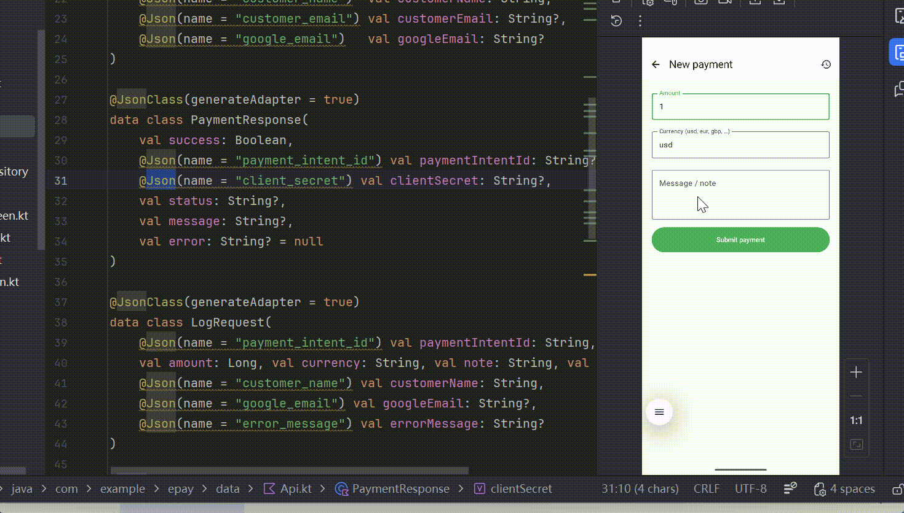
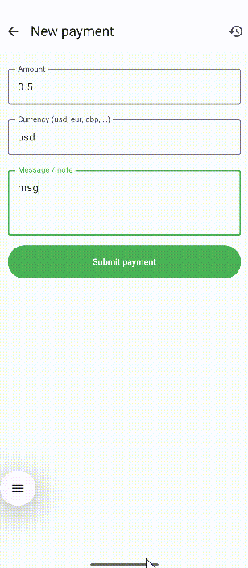
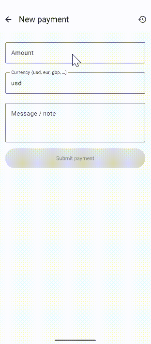

# ePay — Kotlin Android + Flask Proxy + Stripe + Google Sheets

A minimal MVVM payments app. Android app collects amount/note, Flask creates a Stripe PaymentIntent, every transaction is appended to a Google Sheet.

## Screenshot

- A complete run with successful payment

  

- Test with classic Stripe card numbers

  

- Test with payment failure

  

- Test with dark mode

  

- Test with other functions, like input validation, clearing payment history, information modification, logging out

  

## Architecture


## Run
```bash
cd server
pip install -r requirements.txt
cp .env.example .env   # fill in values
python app.py
```
